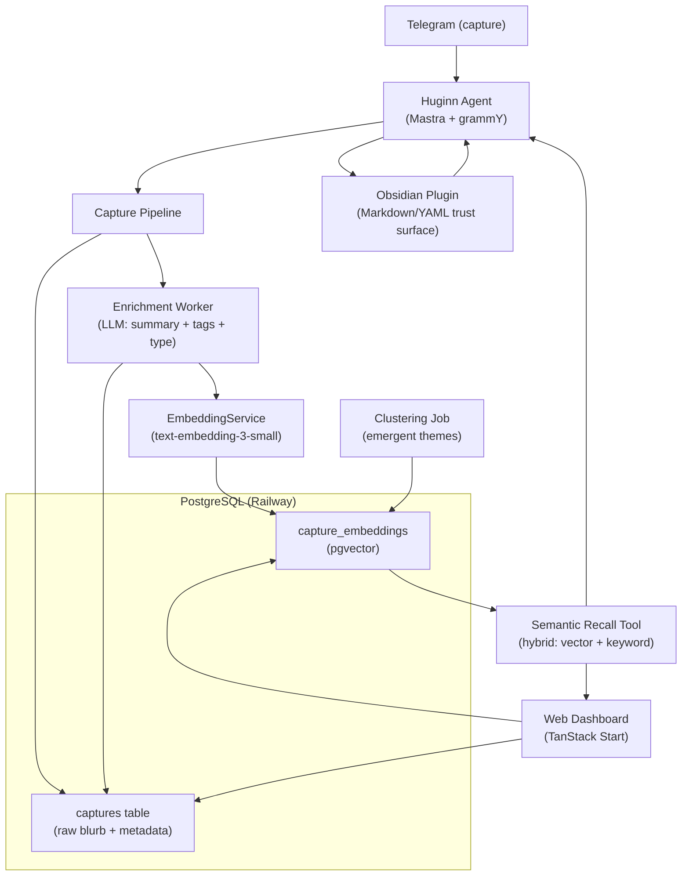

## Overview

This plan brings Huginn's vectorization layer (originally scoped as Phases 6–7) forward into a focused MVP centered on one job: **you dump messy thoughts in, and Huginn makes sense of them automatically.** It builds directly on what's already running in production — the account/identity layer, Telegram channel, Postgres, and Mastra memory — so nothing here requires a rewrite. We extend through existing interfaces.

The design follows an **ADHD-friendly "capture is the only goal" paradigm**: the act of capturing has zero friction (no titling, no tagging, no filing), and all organization happens asynchronously in the background. Research into AI-native note systems (Mem) and embedding-based organization strongly supports this — categorization at capture time is cognitive overhead that breaks the system the moment focus shifts. So Huginn does the work for you: every blurb is enriched by an LLM (summary + auto-tags + type) and embedded into a vector for semantic recall.

<aside>
🧠

The core loop: **Capture (Telegram) → Enrich (LLM tags + embedding) → Store (pgvector) → Recall (semantic search) → Review (dashboard inbox)**. You never organize. You only capture and ask.

</aside>

For categorization, research points to a **hybrid approach**: lightweight **LLM zero-shot tagging** at enrichment time gives immediate structure (type, tags, entities), while **embedding clustering** surfaces emergent themes across your whole corpus without you defining categories up front. Embeddings use a **hosted API (`text-embedding-3-small`)** behind a swappable `EmbeddingService` interface — consistent with your "extend, don't rewrite" and "reversibility" principles, so a local model can drop in later. Calendar-aware proactivity (conflict detection on agreed plans) is intentionally scoped as the **next fast-follow**, not the MVP — it depends on this capture/recall foundation existing first.

## Strategic Refinement: Memory Stewardship

The sharper wedge for Humin is **not** "AI notes with vector search." Mem, Fabric, Notion AI, Slack AI, ChatGPT connectors, Granola, and Obsidian plugins already cover large parts of capture, semantic search, and meeting notes.

Humin's unique point should be **memory stewardship**:

- Capture messy inputs without requiring organization.
- Extract structured memory atoms: facts, commitments, preferences, decisions, open loops, project context, person context, ideas.
- Decide what should be ephemeral, working memory, or durable memory.
- Track what is active, stale, superseded, resolved, or forgotten.
- Surface person/project briefs before context matters.
- Keep source provenance and let the user correct memory with lightweight actions.

In short:

> Mem helps you remember your notes. Humin governs what becomes memory.

This changes the MVP's center of gravity. The key product surface is no longer a dashboard inbox; it is a **brief**: "Brief me for Sam" or "Brief Project Atlas using only context that is still relevant."

## Obsidian Distribution Wedge

Obsidian users are a strong fit because they already value local-first ownership, Markdown durability, plugin workflows, and cross-device sync. However, Humin should **not** depend on a private Obsidian Sync API. Obsidian Sync is not exposed as a public third-party API, and the right integration path is to work with the local vault filesystem.

The opportunity is a Humin Obsidian plugin that writes normal Markdown/YAML into a visible vault folder such as `Humin/`, allowing Obsidian Sync, Git, iCloud, Dropbox, Syncthing, or any other vault sync approach to carry Humin-generated memory naturally.

The plugin wedge:

- `Capture selection to Humin`
- `Brief current note`
- `Brief person/project`
- Show active commitments, stale context, and durable person/project memory in a side panel
- Write memory atoms as Markdown with frontmatter fields like `durability`, `status`, `expires_at`, `source`, `confidence`, `people`, and `projects`
- Offer review actions: keep, forget, make durable, mark stale, mark resolved

This should be treated as a distribution and trust surface, not a replacement for the core Telegram-first memory substrate.

## Your Preferences

**Decisions confirmed during planning:**

- **Embedding model** → Hosted API (`text-embedding-3-small`), placed behind a swappable `EmbeddingService` interface so a self-hosted model can replace it later without code changes.
- **Categorization** → Research-driven *hybrid*: LLM zero-shot tagging at capture (immediate structure) + embedding clustering for emergent themes (no pre-defined folders).
- **MVP boundary** → Capture + categorize + semantic recall **plus** a review/dashboard inbox surface.
- **Capture surface** → Telegram only (already built and linked).
- **Calendar context** → Explicitly **out of MVP**; scoped as the immediate fast-follow once recall is solid.

**Guiding principles carried from the PRD:**

- Self-host always · Extend, don't rewrite · Earn complexity · Reversibility (everything behind interfaces)
- ADHD-first UX: capture has zero friction; the AI does 100% of the organizing.

## Implementation Plan

### Step 1: Stand up the vector layer on Postgres

Enable **pgvector** on the existing Railway Postgres and add the storage schema for captures. No new infrastructure — we extend the single instance.

- [ ]  Enable the `pgvector` extension (`CREATE EXTENSION vector`) in the `public` schema
- [ ]  Add Drizzle schema + migration in `packages/shared` for the new tables
- [ ]  Keep everything account-scoped (`account_id` FK) for multi-user isolation

**New tables:**

| Table | Purpose | Key fields |
| --- | --- | --- |
| `captures` | One row per raw blurb | `id`, `account_id`, `raw_text`, `source` (telegram), `created_at`, `status` (pending/enriched), `summary`, `type`, `tags` (jsonb), `entities` (jsonb) |
| `capture_embeddings` | Vector per capture (or chunk) | `id`, `capture_id` FK, `embedding vector(1536)`, `model`, `created_at` |
| `capture_clusters` | Emergent themes (Step 6) | `id`, `account_id`, `label`, `centroid vector(1536)`, `size` |

<aside>
💡

Use `text-embedding-3-small` → 1536 dimensions. Start with **exact search** (sequential scan) at MVP scale, then add an **HNSW index** once the corpus grows — research shows indexes aren't worth it under ~10k rows and exact search gives 100% recall.

</aside>

### Step 2: Build the EmbeddingService behind an interface

Add a stable, swappable embedding interface in `packages/shared` — mirroring the existing `PersonalityStore` / `AccountService` pattern so the hosted model can be replaced with a local one later (reversibility principle).

```tsx
export interface EmbeddingService {
  embed(text: string): Promise<number[]>;          // single
  embedBatch(texts: string[]): Promise<number[][]>; // batched, cost-efficient
  readonly model: string;
  readonly dimensions: number;
}
```

- [ ]  Implement `OpenAIEmbeddingService` using `text-embedding-3-small`
- [ ]  Add `OPENAI_API_KEY` to env + `.env.example`
- [ ]  Batch embeds where possible to cut cost/latency
- [ ]  Normalize vectors (unit length) so cosine distance behaves consistently

<aside>
🔁

Because it's behind an interface, swapping to a self-hosted model (e.g. `nomic-embed` via Ollama) later is a one-file change — no migration of the calling code.

</aside>

### Step 3: Zero-friction capture via Telegram

Make capturing a thought effortless. Any message that isn't a command becomes a capture — no titling, no tagging, no decision required.

- [ ]  Treat free-text Telegram messages as captures (distinct from conversational queries)
- [ ]  Optionally support a `/dump` prefix or just auto-detect short, non-question blurbs
- [ ]  Write the raw text to `captures` immediately with `status = pending` and **instantly acknowledge** ("Got it 🧠") — capture must never block on enrichment
- [ ]  Enqueue enrichment async (Mastra workflow / background task), matching the existing non-blocking Observer pattern

<aside>
⚡

**The capture moment is precious and brief.** The only synchronous work is writing the raw row + acking. Everything else happens in the background.

</aside>

**Open design note to validate during build:** distinguishing a *capture* ("call dentist re: filling") from a *question to the agent* ("what did I say about the dentist?"). Start with a simple heuristic (questions / `?` / command verbs route to the agent; everything else is a capture) and refine from real usage.

### Step 4: Enrichment pipeline — LLM tagging + embedding

The background worker that turns madness into structure. For each pending capture:

1. **LLM enrichment** (Gemini Flash for cost, escalate to Sonnet if quality lacking) extracts a structured object via a single prompt:
    - `summary` — one-line normalization of the blurb
    - `type` — e.g. `task`, `idea`, `note`, `reminder`, `person`, `decision`
    - `tags` — 1–5 free-form topical tags (zero-shot, not from a fixed list)
    - `entities` — people, dates, projects mentioned
2. **Embed** the `raw_text` (+ summary) via `EmbeddingService` → store in `capture_embeddings`
3. Update the capture row to `status = enriched`

```
captures (pending)
  → Enrichment workflow loads raw_text
  → LLM extracts { summary, type, tags, entities }
  → EmbeddingService.embed() → vector
  → save vector + enrichment, mark enriched
```

<aside>
🏷️

**Why hybrid (research-backed):** LLM zero-shot tagging gives *immediate, queryable* structure the moment something is captured, while embeddings power *meaning-based* recall. Tags are emergent (the model proposes them) — you never maintain a tag taxonomy.

</aside>

- [ ]  Make enrichment idempotent + retriable (re-run safely on failure)
- [ ]  Log token cost per enrichment to monitor spend

### Step 5: Semantic recall — ask, don't browse

Give the Huginn agent a tool to retrieve captures by meaning, so you can ask things like *"what was that idea about the onboarding flow?"* or *"what should I follow up on this week?"*

- [ ]  Add a Mastra **`recall-captures` tool**: embeds the query, runs vector similarity (cosine) over `capture_embeddings`, returns top-K with summaries + tags
- [ ]  **Hybrid search**: combine vector similarity with keyword/tag/`type` filters (research shows hybrid beats pure-vector for short, noisy notes)
- [ ]  Apply **recency weighting** so recent captures rank slightly higher
- [ ]  Always scope queries by `account_id` (isolation)
- [ ]  Agent cites what it recalled ("Based on a note you captured Tuesday…") for trust

<aside>
🎯

**North-star moment:** you ask about something from weeks ago and Huginn surfaces it accurately — capture once, retrieve by meaning forever.

</aside>

### Step 6: Emergent theme clustering

Surface structure *across* your corpus without you defining any categories — the "make sense of all the madness" payoff.

- [ ]  Add a scheduled/triggered **clustering job** over `capture_embeddings` (k-means or HDBSCAN; HDBSCAN auto-determines cluster count and handles outliers well)
- [ ]  Use an LLM to **label each cluster** with a human-readable theme ("Sentiment Hound architecture", "D&D / Strixhaven", "errands")
- [ ]  Persist clusters + centroids in `capture_clusters`; re-run incrementally as the corpus grows

<aside>
🌱

Themes *emerge* from what you actually capture rather than being imposed up front. A blurb that's "half-work, half-personal" doesn't need to be forced into one folder — clustering reveals natural groupings.

</aside>

*Scope guard:* keep MVP clustering simple (one batch pass + labels). Real-time re-clustering is a later optimization.

### Step 7: Review dashboard — the inbox surface

A web surface (TanStack Start, reusing existing Google-auth dashboard) where you can *see* what Huginn captured and organized — without ever having to organize it yourself.

**Views to build:**

- [ ]  **Inbox** — reverse-chronological feed of captures with AI summary, type badge, and tags
- [ ]  **Search** — semantic search box powered by the Step 5 recall logic (vector + keyword)
- [ ]  **Themes** — browse the emergent clusters from Step 6; click a theme to see its captures
- [ ]  **Filters** — by `type` (task/idea/note…), tag, and date
- [ ]  Lightweight edit/override (fix a wrong tag, change a type, delete) — consistent with the PRD's "user owns everything" agency principle

<aside>
📥

The dashboard is **read-and-review, not maintain.** It exists to let you trust and explore what the AI did — never to make you file things.

</aside>

### Step 8: Acceptance criteria, metrics & calendar fast-follow

**MVP acceptance criteria:**

- [ ]  A Telegram blurb is captured + acknowledged in < 1s, enriched async within seconds
- [ ]  Every enriched capture has a summary, type, tags, and a stored embedding
- [ ]  Asking the agent a meaning-based question returns the right capture from days/weeks ago
- [ ]  The dashboard inbox, semantic search, and theme clusters all work and stay account-isolated
- [ ]  Capture requires **zero** organizing decisions from the user

**Success signals:**

- The "it just knows" moment — recall surfaces something you'd forgotten
- You capture *more* freely because there's no filing tax

---

**Next fast-follow (post-MVP) — Calendar-aware proactivity:**

<aside>
📅

Once recall is solid, connect **Google Calendar** (your existing Google OAuth makes this natural). Captures tagged as commitments (e.g. "dinner with Sam Thursday") get checked against your calendar, and Huginn **proactively flags clashes** — "heads up, you already have HQ Dinner Thursday evening." This depends on the capture → entity-extraction → recall pipeline existing first, which is exactly what this MVP delivers.

</aside>

- Entity extraction (Step 4) already captures dates/commitments → feeds calendar matching
- Add a read-only Google Calendar integration + a conflict-detection check
- Proactive nudges become a new agent capability layered on top — no rework of the MVP

**Distribution fast-follow — Obsidian plugin:**

<aside>
📝

Once the memory atom + brief loop works, build a small Obsidian plugin as a trust and distribution surface. The plugin should not try to replace Obsidian Sync. Instead, it should write Humin memory into regular Markdown files inside a visible vault folder, so users can inspect, edit, and sync the output with their existing Obsidian setup.

</aside>

- Add commands for `Capture selection to Humin`, `Brief current note`, and `Brief person/project`
- Write memory atoms into `Humin/Memory/` with YAML frontmatter for lifecycle fields
- Write generated briefs into `Humin/Briefs/`
- Show a side panel for active commitments, stale/superseded notes, and durable context
- Send review actions back to Humin: keep, forget, make durable, mark stale, mark resolved
- Keep the plugin distinct from semantic-search plugins like Smart Connections by focusing on memory lifecycle, not related-note retrieval

## Architecture


