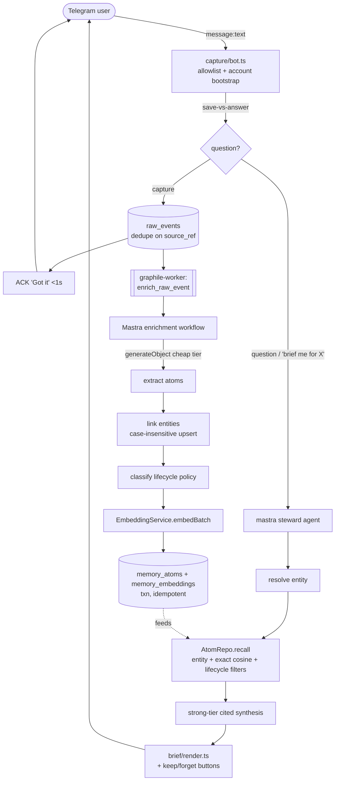

# Humin MVP — Execution Plan

## 1. Goal

Ship the **"Brief me for Sam"** magic moment to a handful of internal users as fast as possible: a user dumps messy thoughts into Telegram, Humin captures them friction-free, extracts lifecycle-aware **memory atoms**, and on request returns a concise, **cited**, judgment-bearing **brief** (open commitments, durable preferences, current context, recent working memory, stale/contradicted facts flagged) with lightweight correction actions. We build the **simplest single monolith** that proves this, structured behind interfaces so capture / enrichment / brief can later split into services and so the whole thing can merge into a Huginn-style monorepo. Time-to-magic-moment is the optimization target; everything else serves that.

---

## 2. Reality check & approach

**The repo is greenfield.** `/home/odin/Dungeon/Personal/humin` contains only `README.MD` and `mvp-plan.md` — no code, no `package.json`, no Huginn monorepo. The "Huginn" production system the docs reference (packages/shared, PersonalityStore, AccountService, an existing grammY bot, a TanStack dashboard, Railway Postgres, Mastra memory) **does not exist on this machine.** We build **fresh**, but deliberately **mirror Huginn's patterns and names** (account-scoped tables, an `accounts`/identity notion, interface-based services, a `src/shared` contract layer) so this can later align with or merge into Huginn.

**Authority:** `mvp-plan.md` wins where it conflicts with `README.MD`. README's full dashboard inbox and theme clustering are **non-goals**. `README.MD`'s vectorization-layer framing is mined only for extra detail.

### Guiding principles

- **Self-host friendly.** One Node process + one Postgres. No Redis, no extra services, no serverless. Runs on Railway today, on a laptop or a VPS tomorrow.
- **Extend, don't rewrite, into Huginn later.** Keep the schema and service contracts in a `src/shared` layer that mirrors `packages/shared`, account-scope every table, so a future merge is a move-and-import, not a rewrite.
- **Earn complexity.** Build the narrowest end-to-end magic trick first (walking skeleton). Lifecycle judgment, expiry, staleness, the full eval harness, hybrid keyword fusion, and HNSW are **added after** the spine works — not before.
- **Reversibility behind interfaces.** The only structural cost we pay up front is a thin set of interfaces (`EmbeddingService`, `ModelGateway`, repositories, `JobQueue`). Implementations are swappable; the memory model lives in Humin's own Postgres tables, **never** inside Mastra.

**What we explicitly do NOT do up front (per the critique):** no pnpm workspace / `apps/*` + `packages/*` split, no pre-cut microservice folders, no second/third Mastra agent, no `memory_links` / staleness / expiry / 8-action correction map / RRF fusion / tsvector column / HNSW / brief caching / day-1 OTEL / pgEnums on the first slice. A **single flat package with a `src/shared/interfaces` folder** satisfies the reversibility constraint at a fraction of the cost.

---

## 3. Key decisions

| # | Decision | Why | Notable alternative (rejected) |
|---|---|---|---|
| D1 | **Mastra from day 1** as the agent/tools/workflow/orchestration layer, embedded in our process — but it does **NOT** own the memory model. | Spec constraint #3. Gives Agents, Tools (zod-typed `createTool`), Workflows, Studio traces, and Scorers in one framework. Humin's Postgres tables stay the source of truth. | Hand-rolled agent loop (more code, loses Studio/scorers). |
| D2 | **OpenRouter is the single CHAT gateway** via `@openrouter/ai-sdk-provider`, with **named model tiers** (`cheap` extraction, `strong` synthesis) resolved from env in one `models.ts`. | Spec constraint #4. One key, OpenAI-compatible, provider+model fallbacks, no inference markup. Swapping a tier = one env var. | Integrating Anthropic/Google/OpenAI SDKs separately (rejected by #4). |
| D3 | **Embeddings: OpenRouter does NOT reliably do embeddings for us — use OpenAI-direct `text-embedding-3-small` (1536d) behind `EmbeddingService`.** | OpenRouter has a GA `/embeddings` endpoint *now*, BUT AI-SDK-level support is **unverified** and embeddings are on the critical path (recall needs them). Lowest-risk default is the battle-tested OpenAI SDK. Single-key-via-OpenRouter-REST stays a one-line swap behind the interface. We persist `(model, dimensions)` per row so any future swap is unambiguous. | OpenRouter `/embeddings` default (chase single key, risk an in-region surprise that stalls recall). |
| D4 | **Postgres + pgvector, EXACT cosine search first.** Add HNSW (raw SQL) only past ~10k rows. | <10k rows: sequential cosine scan is single-to-low-double-digit ms with **100% recall**, and avoids the drizzle-kit HNSW operator-class strip bug (#5792). | HNSW from day one (premature; triggers #5792; IVFFlat needs data to train). |
| D5 | **Async jobs + scheduler = `graphile-worker`** (Postgres-backed), in-process, reused for both enrichment jobs and (later) cron sweeps. | Captures must never drop. Durable jobs survive restart, SKIP-LOCKED concurrency, retries/backoff, LISTEN/NOTIFY, crontab with `?fill` backfill for missed expiry windows — **no Redis/extra infra**. Mastra workflows are the job *body*, not the queue. | Mastra background tasks (lose executor closures on restart); `node-cron` (silently drops missed windows); `pg-boss` (fine alternative, chose graphile-worker for SKIP-LOCKED + backfill). |
| D6 | **Local models deferred but swappable.** Default chat = OpenRouter; default embeddings = OpenAI-direct. `OllamaEmbeddingService` / local chat are config swaps behind the interfaces — built only when someone actually swaps. | Local embedding is an explicit MVP non-goal. The interfaces are the entire reversibility cost we pay now; a stub impl is wasted effort. Local earns its place later on **cost** (embeddings) or **privacy** (personal memory is the trust story). | Ship an Ollama stub now (effort on a deferred path). |
| D7 | **One long-running Node process on Railway** (grammY long-polling + Mastra + in-process worker + tiny Fastify health endpoint). | Long-polling needs no public URL/SSL; a live host lets the worker + cron run in-process. Fastest to the magic moment. | Webhook now (one-line swap later); serverless (breaks long-polling + native cron). |

---

## 4. POC architecture

A single deployable Node 22 LTS process. One Mastra instance. One Postgres. Modules are organized by folder so they *can* later become services, but they are **not** pre-split into a workspace.

### Directory tree (flat package, split-ready by folder)

```
humin/
  package.json                 # one deployable; engines: node >=22 <23; packageManager pnpm
  pnpm-lock.yaml               # pin exact versions; audit before install (mastra scope was compromised)
  tsconfig.json
  .nvmrc                       # 22
  .env.example
  drizzle.config.ts            # dialect postgresql; schema ./src/shared/schema/*; out ./migrations
  railway.json                 # predeploy = pnpm db:migrate ; start = node dist/main.js
  migrations/
    0000_enable_pgvector.sql   # hand-authored: CREATE EXTENSION vector; (MUST run first)
    0001_init.sql              # generated tables (+ hand-appended CHECK constraints)
  src/
    main.ts                    # composition root: wire deps, start worker + bot + http
    config/
      env.ts                   # zod-validated env (DATABASE_URL, OPENROUTER_API_KEY, OPENAI_API_KEY, ...)
      models.ts                # createOpenRouter() + named tier handles (cheap/strong)
    shared/                    # mirrors Huginn packages/shared (Humin owns the memory model)
      schema/                  # Drizzle tables = source of truth
        accounts.ts raw_events.ts memory_atoms.ts memory_embeddings.ts entities.ts
        enums.ts index.ts      # M1-extra tables (links/briefs/feedback) added at M4, not now
      interfaces/              # REVERSIBILITY SEAMS (no impl)
        EmbeddingService.ts ModelGateway.ts repositories.ts JobQueue.ts
      types.ts                 # zod: ExtractedAtom, BriefResult ; inferred Drizzle row types
    platform/                  # interface IMPLEMENTATIONS (adapters)
      db/client.ts             # pg Pool + drizzle
      db/repositories.ts       # DrizzleMemoryStore: RawEventRepo, AtomRepo, EmbeddingRepo, EntityRepo
      model/OpenRouterModelGateway.ts
      embedding/OpenAIEmbeddingService.ts
      queue/graphileQueue.ts   # JobQueue impl + task registry + crontab
    capture/                   # MODULE: ingress (future service #1)
      bot.ts                   # grammY long-polling; allowlist + account bootstrap
      route.ts                 # save-vs-answer heuristic
    enrichment/                # MODULE: worker (future service #2)
      task.ts                  # graphile task 'enrich_raw_event' -> runs enrichment workflow
    brief/                     # MODULE: read path (future service #3)
      render.ts                # Telegram brief render + inline correction buttons
    mastra/
      index.ts                 # new Mastra({ agents, workflows, scorers })
      agents/steward.ts        # the ONE user-facing agent (strong tier) + the 4 first-slice tools
      tools/                   # capture, recall_memory, brief_person, review_memory
      workflows/enrichment.ts  # extract -> link -> classify -> embed -> persist -> mark processed
    http/server.ts             # Fastify: GET /health, /readyz
  eval/
    seed.ts                    # ~15 labeled captures (grows from real corrections)
    questions.ts               # eval queries + expected must-include / must-exclude atom keys
    run.ts                     # replay through REAL enrichment + brief; score
  scripts/
    smoke.ts                   # post-deploy: capture -> assert atom+embedding -> brief -> assert citation
```

### Component summary

- **`capture/`** — grammY long-polling bot. Allowlist check + Telegram-user→account bootstrap, save-vs-answer routing, writes `raw_events`, ACKs in <1s, enqueues `enrich_raw_event`. **Never enriches inline.**
- **`enrichment/`** — a `graphile-worker` task that runs the Mastra enrichment workflow. Idempotent (dedupe on `source_ref`), retried with backoff by the queue.
- **`brief/` + `mastra/agents/steward.ts`** — entity resolve → lifecycle-aware retrieval → strong-tier cited synthesis → Telegram render with inline correction buttons.
- **`platform/`** — adapters behind the interfaces (Drizzle repos, OpenRouter gateway, OpenAI embedder, graphile queue).
- **`mastra/`** — one Mastra instance; **one** agent; the enrichment workflow uses a **direct `ModelGateway.generateObject` call** for structured extraction (no separate extractor agent).

### Reversibility interfaces (TypeScript sketches)

```ts
// src/shared/interfaces/ModelGateway.ts
import type { ZodType } from 'zod';
export type ModelTier = 'cheap' | 'strong';            // cheap=extraction, strong=brief synthesis
export interface ModelGateway {
  generateObject<T>(args: { tier: ModelTier; system?: string; prompt: string; schema: ZodType<T> }): Promise<T>;
  generateText(args: { tier: ModelTier; system?: string; prompt: string }): Promise<string>;
}

// src/shared/interfaces/EmbeddingService.ts  — dimension is config, persisted per row
export interface EmbeddingService {
  embed(text: string): Promise<number[]>;
  embedBatch(texts: string[]): Promise<number[][]>;
  readonly model: string;        // "text-embedding-3-small"
  readonly dimensions: number;   // 1536  (stored on every embedding row)
}

// src/shared/interfaces/JobQueue.ts
export interface JobQueue {
  enqueue(type: string, payload: unknown, opts?: { maxAttempts?: number }): Promise<void>;
}

// src/shared/interfaces/repositories.ts  — account-scoped; Humin owns the memory model
export interface RawEventRepo {
  create(e: NewRawEvent): Promise<RawEvent>;
  findBySourceRef(accountId: string, source: string, sourceRef: string): Promise<RawEvent | null>; // idempotency
  markStatus(id: string, status: ProcessingStatus): Promise<void>;
}
export interface AtomRepo {
  insertMany(atoms: NewAtom[]): Promise<Atom[]>;
  recall(q: {
    accountId: string; subjectId?: string; queryEmbedding?: number[];
    statuses?: AtomStatus[]; atomTypes?: AtomType[]; limit: number;
  }): Promise<ScoredAtom[]>;                          // exact cosine now; HNSW later behind same signature
  updateStatus(id: string, status: AtomStatus): Promise<void>;
}
export interface EmbeddingRepo {
  insert(atomId: string, accountId: string, vector: number[], model: string, dimensions: number): Promise<void>;
}
export interface EntityRepo {
  resolveOrCreate(accountId: string, type: EntityType, name: string): Promise<Entity>; // case-insensitive upsert
  findByNameOrAlias(accountId: string, name: string): Promise<Entity[]>;
}
export interface AccountRepo {
  resolveByTelegramUserId(telegramUserId: string): Promise<Account | null>;
  createForTelegramUser(telegramUserId: string, displayName?: string): Promise<Account>;
}
export interface MemoryStore {
  accounts: AccountRepo; rawEvents: RawEventRepo; atoms: AtomRepo;
  embeddings: EmbeddingRepo; entities: EntityRepo;
}
```

### The loop



### How it splits into microservices later (note, not now)

The seam is already cut by the interfaces and the queue. When throughput or independent scaling demands it: move `capture/` into an always-on ingress service (keeps `RawEventRepo`), `enrichment/` into a horizontally-scalable worker (the graphile queue table is *already* the decoupling boundary — extra workers just poll the same Postgres), and `brief/` into a latency-sensitive read service (can use a read replica). **What stays shared:** `src/shared` (schema + interfaces) and the one Postgres. Nothing in the memory model changes on split.

---

## 5. Data model

Mirrors `mvp-plan.md`'s tables, account-scoped, in `src/shared/schema`. **First slice ships only the tables on the critical path:** `accounts`, `raw_events`, `memory_atoms`, `memory_embeddings`, `entities`. `memory_links`, `briefs`, `memory_feedback` are **added at M4**, not now.

| Table | Purpose | Key fields | Notes |
|---|---|---|---|
| `accounts` | identity anchor (mirrors Huginn AccountService) | `id`, `telegram_user_id` (unique), `display_name`, `created_at` | minimal; real identity lives in Huginn later |
| `raw_events` | one row per ingested message | `id`, `account_id`, `source`, `source_ref`, `raw_text`, `occurred_at`, `ingested_at`, `metadata` jsonb, `processing_status` | **UNIQUE(account_id, source, source_ref)** for dedupe; index on `processing_status` |
| `memory_atoms` | extracted atoms + lifecycle | `id`, `account_id`, `raw_event_id` (FK, `ON DELETE RESTRICT` — preserve provenance), `atom_type`, `subject_type`, `subject_id` (FK→entities, `SET NULL`), `content`, `summary`, `entities` jsonb, `importance` 1-5, `confidence` 0-1, `durability`, `status`, `ttl` (int sec, **descriptive**), `expires_at` (timestamptz, **authoritative**), `reason_retained`, `created_at`, `updated_at` | see source-of-truth note below; CHECK `importance BETWEEN 1 AND 5`, `confidence BETWEEN 0 AND 1` |
| `memory_embeddings` | one vector per atom/chunk | `id`, `account_id`, `memory_atom_id` (FK, `CASCADE`), `embedding vector(1536)`, `model`, `dimensions`, `created_at` | EXACT search; `(model,dimensions)` persisted so a provider swap is explicit |
| `entities` | people/projects/orgs/topics | `id`, `account_id`, `type`, `name`, `aliases` jsonb, `metadata` jsonb | **UNIQUE(account_id, type, lower(name))** for upsert discipline |
| *(M4)* `memory_links` | atom↔atom edges | `from_atom_id`, `to_atom_id`, `relation`, `confidence` | added with staleness workflow |
| *(M4)* `memory_feedback` | corrections as signal | `memory_atom_id`, `feedback_type`, `previous_value` jsonb, `new_value` jsonb | thin keep/forget log lands earlier (M3); full set at M4 |
| *(M4, optional)* `briefs` | brief cache/history | `subject_id`, `content`, `source_atom_ids` jsonb | not needed to prove the moment; defer |

**pgvector / enum / index notes**

- **`CREATE EXTENSION IF NOT EXISTS vector;` is migration `0000`, hand-authored, ordered before any vector column.** drizzle-kit does NOT emit it (#3929/#2231); a vector-column migration first fails with `type "vector" does not exist`.
- **Enums as plain text columns for the POC, not pgEnum.** The lifecycle value sets are still being calibrated; `ALTER TYPE ... ADD VALUE` is transaction-unsafe and a migration footgun. Use Drizzle's `text(...).$type<AtomType>()` for TS safety + DB flexibility. (Promote to pgEnum once the value sets stabilize.)
- **Source of truth for expiry: `expires_at` is authoritative; app derives it as `created_at + ttl` at write time.** `ttl` is descriptive only. This avoids the drift bug; the expiry sweep filters solely on `expires_at`.
- **`text-embedding-3-small` vectors are pre-L2-normalized** → use `vector_cosine_ops`, no manual normalization.
- **Indexes (0001):** btree `(account_id, status)`, `(account_id, subject_type, subject_id)`, `(account_id, atom_type)` on atoms; `(processing_status)` on raw_events; GIN on jsonb only if/when filtered. **No vector index at MVP** (exact scan).
- **HNSW deferred:** when `memory_embeddings` > ~10k rows, add as **raw SQL** (`CREATE INDEX ... USING hnsw (embedding vector_cosine_ops)`) — never via the Drizzle DSL (#5792 strips the operator class).

**Drizzle schema sketch (excerpt)**

```ts
// src/shared/schema/memory_atoms.ts
import { pgTable, uuid, text, integer, doublePrecision, timestamp, jsonb, index } from 'drizzle-orm/pg-core';
import { accounts } from './accounts'; import { rawEvents } from './raw_events'; import { entities } from './entities';
import type { AtomType, Durability, AtomStatus, SubjectType } from './enums';

export const memoryAtoms = pgTable('memory_atoms', {
  id: uuid('id').defaultRandom().primaryKey(),
  accountId: uuid('account_id').notNull().references(() => accounts.id, { onDelete: 'cascade' }),
  rawEventId: uuid('raw_event_id').notNull().references(() => rawEvents.id, { onDelete: 'restrict' }),
  atomType: text('atom_type').$type<AtomType>().notNull(),
  subjectType: text('subject_type').$type<SubjectType>().notNull().default('none'),
  subjectId: uuid('subject_id').references(() => entities.id, { onDelete: 'set null' }),
  content: text('content').notNull(),                 // verbatim supporting slice
  summary: text('summary').notNull(),                 // clean one-liner
  entities: jsonb('entities').$type<{ people?: string[]; projects?: string[]; dates?: string[] }>().default({}).notNull(),
  importance: integer('importance').notNull().default(3),
  confidence: doublePrecision('confidence').notNull().default(0.5),
  durability: text('durability').$type<Durability>().notNull(),
  status: text('status').$type<AtomStatus>().notNull().default('active'),
  ttl: integer('ttl'),                                // descriptive (seconds)
  expiresAt: timestamp('expires_at', { withTimezone: true }), // AUTHORITATIVE = created_at + ttl
  reasonRetained: text('reason_retained'),
  createdAt: timestamp('created_at', { withTimezone: true }).defaultNow().notNull(),
  updatedAt: timestamp('updated_at', { withTimezone: true }).defaultNow().notNull(),
}, (t) => ({
  byStatus: index('atoms_status_idx').on(t.accountId, t.status),
  bySubject: index('atoms_subject_idx').on(t.accountId, t.subjectType, t.subjectId),
  byType: index('atoms_type_idx').on(t.accountId, t.atomType),
  byExpiry: index('atoms_expires_idx').on(t.expiresAt),
}));

// src/shared/schema/memory_embeddings.ts (excerpt)
import { vector } from 'drizzle-orm/pg-core';
export const memoryEmbeddings = pgTable('memory_embeddings', {
  id: uuid('id').defaultRandom().primaryKey(),
  accountId: uuid('account_id').notNull().references(() => accounts.id, { onDelete: 'cascade' }),
  memoryAtomId: uuid('memory_atom_id').notNull().references(() => memoryAtoms.id, { onDelete: 'cascade' }),
  embedding: vector('embedding', { dimensions: 1536 }).notNull(),
  model: text('model').notNull().default('text-embedding-3-small'),
  dimensions: integer('dimensions').notNull().default(1536),
  createdAt: timestamp('created_at', { withTimezone: true }).defaultNow().notNull(),
});
```

**Exact top-K cosine recall (the only search at MVP):**

```ts
import { cosineDistance, sql, and, eq, ne, gt, desc } from 'drizzle-orm';
const sim = sql<number>`1 - (${cosineDistance(memoryEmbeddings.embedding, queryVec)})`; // DISTANCE -> similarity
db.select({ atomId: memoryEmbeddings.memoryAtomId, similarity: sim })
  .from(memoryEmbeddings)
  .innerJoin(memoryAtoms, eq(memoryAtoms.id, memoryEmbeddings.memoryAtomId))
  .where(and(
    eq(memoryEmbeddings.accountId, accountId),
    ne(memoryAtoms.status, 'forgotten'),   // default filter
    gt(sim, 0.25),                         // threshold on (1 - distance), NOT raw distance
  ))
  .orderBy((x) => desc(x.similarity))
  .limit(k);
```

---

## 6. Agent, tools & model routing

**One** user-facing Mastra agent (`steward`, strong tier). Extraction is a **direct `ModelGateway.generateObject` call** inside the enrichment workflow — no separate extractor/judge agents (those were over-built). A tool never touches SQL or a raw OpenRouter client; it calls a **repository interface** + the **ModelGateway**.

### First-slice tools

| Tool | Purpose | Inputs (zod) | Outputs (zod) | Uses |
|---|---|---|---|---|
| `capture` | persist raw message, ACK, enqueue (no LLM) | `{ accountId, source:'telegram', sourceRef, rawText, occurredAt }` | `{ rawEventId, accepted, ackMessage }` | `RawEventRepo.create` + `JobQueue.enqueue('enrich_raw_event')` |
| `recall_memory` | meaning + filter retrieval for free-text questions | `{ accountId, query, k?=8, filters?:{ atomType?, subjectId?, statuses? } }` | `{ results: ScoredAtom[] }` | `EmbeddingService.embed` + `AtomRepo.recall` |
| `brief_person` | **the magic moment**: resolve person → lifecycle-aware retrieval → cited brief | `{ accountId, personRef }` | `{ subjectEntityId?, brief, citations[], actions[] }` *(or empty/disambiguation state)* | `EntityRepo.findByNameOrAlias`, `AtomRepo.recall`, strong-tier synthesis |
| `review_memory` | apply a correction (**keep / forget only** at first slice) | `{ accountId, atomId, action:'keep'\|'forget' }` | `{ atomId, applied, newStatus? }` | `AtomRepo.updateStatus` (+ thin feedback log) |

> M3 adds `brief_project`, `list_followups`. M4 expands `review_memory` to `make_durable / mark_resolved / mark_stale / wrong_person / wrong_project`; `merge_with` lands **last** (needs `memory_links`).

### Named model tiers (OpenRouter, swap = one env var)

`src/config/models.ts`:

```ts
import { createOpenRouter } from '@openrouter/ai-sdk-provider';
import { env } from './env';
const openrouter = createOpenRouter({ apiKey: env.OPENROUTER_API_KEY });
export const MODELS = {
  cheap:  openrouter(env.MODEL_CHEAP),   // high-volume extraction / classification
  strong: openrouter(env.MODEL_STRONG),  // brief synthesis (the product)
};
```

| Tier | Role | Default ID (env `MODEL_*`) | Cheaper alt | Stronger alt |
|---|---|---|---|---|
| `cheap` | extraction + lifecycle suggestion | `google/gemini-2.5-flash` | `openai/gpt-4o-mini`, `deepseek/deepseek-chat` | `anthropic/claude-haiku-4` |
| `strong` | brief synthesis (cited, lifecycle-aware) | `anthropic/claude-sonnet-4` | `google/gemini-2.5-pro` | `anthropic/claude-opus-4`, `openai/gpt-5.5` |

Embeddings are **separate** (OpenAI-direct, `text-embedding-3-small`, `EMBEDDING_DIMENSIONS=1536`) behind `EmbeddingService`.

> Pin note: if installed Mastra is on AI SDK **v5**, pin `@openrouter/ai-sdk-provider@1.5.4`; on **v6** use latest. Decide at scaffold. Smoke-test `generateObject` (structured output) + tool calling on the exact `cheap`/`strong` IDs **before** building enrichment (#6678/#9760 apiKey/header bugs; not every model supports the ai-sdk path).

### Capture-vs-question heuristic (rules-first, default-to-capture)

```ts
// src/capture/route.ts
export type Route = 'capture' | 'question' | 'command';
export function classifyMessage(text: string): { route: Route; confidence: number } {
  const t = text.trim();
  if (t.startsWith('/')) return { route: 'command', confidence: 1 };
  const lower = t.toLowerCase();
  const qWords = /^(who|what|when|where|why|how|which|do|does|did|is|are|can|should|could|would|will)\b/;
  // 'brief' MUST be caught as a question verb, else 'brief me for Sam' gets silently saved as a note
  const briefVerbs = /\b(brief me|brief project|brief|remind me|what did i|what should i|what changed|what is stale|recall|search)\b/;
  if (t.endsWith('?') || qWords.test(lower) || briefVerbs.test(lower)) return { route: 'question', confidence: 0.9 };
  return { route: 'capture', confidence: 0.6 }; // default-to-capture: a misrouted capture is recoverable, a dropped thought is not
}
```

Refinement ladder (do not build all now): rules → optional cheapest-model tiebreak only when `confidence < 0.7` → mine misroutes from corrections. On any classifier error/timeout, **default to capture**.

---

## 7. Core workflows

### Capture (synchronous, in the bot handler)

```
message:text
  -> allowlist check (reject strangers) ; resolve/create account by telegram_user_id
  -> classifyMessage(): question/command -> steward agent ;  else capture
  -> INSERT raw_events {account_id, source:'telegram',
       source_ref = `${chat_id}:${message_id}`, raw_text, occurred_at, status:'pending'}
       ON CONFLICT (account_id, source, source_ref) DO NOTHING RETURNING id   -- dedupe
  -> reply "Got it 🧠"   (<1s; never calls the LLM/embed inline)
  -> JobQueue.enqueue('enrich_raw_event', { rawEventId, accountId }, { maxAttempts: 5 })
```

**Idempotency key is decided: `source_ref = chat_id:message_id`** (per-message, stable across redelivery), written into the unique index. (`update_id` is per-update, not per-message — rejected.)

### Enrichment (async graphile task = workflow body; idempotent + retriable)

```
guard: load raw_event; if processing_status='processed' -> no-op (safe re-run)
extract:    ModelGateway.generateObject(tier:'cheap', schema: AtomArraySchema) over raw_text  -> 0..N atoms
linkEntity: for each people/projects -> EntityRepo.resolveOrCreate (case-insensitive, lower(name))  -> set subject_type/subject_id
classify:   deterministic lifecycle policy (below) seeded by LLM suggestion, policy wins; derive expires_at = created_at + ttl
embed:      EmbeddingService.embedBatch(atoms.map(a => `${a.summary}\n${a.content}`))
persist (TXN): DELETE prior atoms+embeddings for raw_event_id ; INSERT atoms ; INSERT embeddings(model,dimensions)
mark:       UPDATE raw_events SET processing_status='processed'
```

Step-level retries for transient LLM/network errors; the queue gives at-least-once + backoff.

**Lifecycle default policy (deterministic, code-owned — judgment we own, not the model's):**

| atom_type | durability | ttl / status |
|---|---|---|
| `commitment` | working | no ttl, `active` until resolved (importance ≥4) |
| `preference` | durable | no ttl |
| `decision` | durable | no ttl (until superseded) |
| `fact` | working (durable if importance ≥4) | 30d |
| `open_loop` / `project_context` / `idea` | working | 14–30d (promote on reuse) |
| `person_context` | durable if stable trait else working | 30d |
| `question` | ephemeral | 7d |

### Brief (request-time — the magic moment)

```
resolveEntity:  parse "brief me for Sam" / "brief project OAuth" -> EntityRepo.findByNameOrAlias
  -> 0 matches  -> EMPTY STATE: "I don't have any memory for 'Sam' yet."
  -> >1 matches -> DISAMBIGUATE: "Did you mean Sam Lee or Sam Park?"
retrieve (hybrid, MVP recipe):
  a) durable preferences:  subject=entity AND durability='durable' AND status!='forgotten'
  b) recent working:       durability='working' AND status IN(active,stale) AND recency-weighted
  c) open commitments:     atom_type='commitment' AND status='active'  (boosted)
  d) semantic:             EmbeddingService.embed(query) -> exact cosine top-K, filters pushed INSIDE the query
     (keyword/tsvector + RRF fusion are DEFERRED — pure vector + entity match is enough at <10k atoms)
rank:   simple boost = base_similarity * (1 + 0.5*openCommitment + 0.4*durable + 0.3*importanceNorm + 0.3*recencyNorm)
        exclude forgotten; multiply stale by 0.4 (deprioritize, don't drop)
synthesize (STRONG tier): brief sections — current context / open loops / your commitments /
        others' commitments / durable preferences / recent working memory / stale-or-contradicted / sources.
        SYSTEM: "Use ONLY the provided atoms. Every claim MUST cite its atom id. Do not invent. Omit empty sections."
render: brief/render.ts -> Telegram message + inline buttons [keep][forget] per cited atom
```

### Expiry *(M4, cron)*

```
'0 3 * * * expiry_sweep ?fill=1d'   (graphile crontab, backfill re-runs windows missed during a deploy)
SELECT atoms WHERE expires_at < now() AND status='active'
  ephemeral -> status='forgotten' (soft-delete; provenance preserved, excluded from retrieval)
  working & not reinforced -> status='stale'
  durable -> never auto-expired
```

### Staleness *(M4, on new atom)*

```
same-subject candidates (or top cosine neighbors) excluding self, status!='forgotten'
strong-tier judge -> none|supports|contradicts|supersedes + confidence
INSERT memory_links ; if (contradicts|supersedes) AND confidence>=0.8 -> mark OLDER 'superseded' ; else flag for review
```

### Structured extraction JSON shape (cheap tier, zod-validated)

```jsonc
{
  "atoms": [
    {
      "atom_type": "fact|commitment|preference|decision|open_loop|project_context|person_context|idea|question",
      "subject": { "type": "person|project|org|topic|none", "name": "string|null" },
      "summary": "one clean sentence",
      "supporting_text": "verbatim span that supports this atom",
      "people": ["string"],
      "projects": ["string"],
      "dates": [{ "kind": "deadline|event|mentioned", "iso": "2026-06-26", "text": "by Friday" }],
      "suggested_durability": "ephemeral|working|durable",
      "suggested_expiry_days": 7,
      "confidence": 0.0,
      "reason_retained": "why this is worth remembering"
    }
  ]
}
```

System prompt: *"You extract durable memory atoms from a messy capture. Return ONLY JSON matching the schema. One capture may yield 0..N atoms. Do not invent facts. Resolve relative dates against {{occurred_at}} to ISO-8601. If nothing is worth remembering, return `{ "atoms": [] }`."*

---

## 8. Eval harness

Per the critique, start with a **~15-capture smoke eval**, not a 50–100 labeled golden set. It replays through the **real** enrichment + brief code paths (queue bypassed via direct workflow call) against a throwaway test DB, and **grows from real corrections** later.

**Seed dataset (`eval/seed.ts`, ~15 captures):** a few facts/context, ~4 commitments (one later resolved), ~2 preferences, 1 decision, ~2 contradiction pairs (e.g. "Launch is Aug 1" then "Launch moved to Sep 15"), 1 noisy Slack-style digest, 1 "wrong person" trap (Sam vs Samir). Each labeled with `expected_atoms` and, for brief queries, `must_include` / `must_exclude` atom keys.

**Eval questions (`eval/questions.ts`):** `brief me for Sam`, `what did I promise Priya?`, `what should I follow up on?`, `what context is stale for Project Atlas?`.

**Metrics (only two gate the first slice; grow later):**

| Metric | Gate | When |
|---|---|---|
| `topAtomInTop5` — the expected correct atom is in top-5 retrieved | ≥ 0.9 | first slice |
| `everyClaimCitesAtom` — every brief line carries ≥1 `[atom_id]` | == 1.0 | first slice |
| `commitmentsIncluded` | ≥ 0.95 | M3 |
| `expiredNoiseExcluded` | ≥ 0.95 | M4 |
| `staleIdentified` | ≥ 0.8 | M4 |
| `userCorrectionRate` (from feedback log) | tracked, not gated | M5 |

Scorers register on the Mastra instance and run in CI on every prompt/retrieval/policy change. A single model-graded `briefQuality` scorer is added at M4 only.

---

## 9. Delivery roadmap

Ordering is **ordinal** (dependencies), not calendar. The Walking Skeleton precedes M1–M5 and **is** the critical path; later milestones deepen a working spine.

### PHASE 0 — Walking Skeleton (thinnest end-to-end == CRITICAL PATH)

Goal: type two captures about "Sam", then "Brief me for Sam" → get a **cited** brief in Telegram. No lifecycle judgment, no expiry, no staleness, no `memory_links`, no HNSW. Every atom is `status=active`.

- [ ] **FIRST coding task — smoke-test OpenRouter `generateObject` on the exact `cheap`/`strong` model IDs** (structured extraction must emit schema-valid JSON via `@openrouter/ai-sdk-provider`) AND OpenAI-direct embeddings round-trip into `vector(1536)`. This gates everything downstream.
- [ ] Scaffold one `create-mastra` app; Node 22 LTS; TS; zod v4. **Pin exact `mastra`/`@mastra/*` versions, audit lockfile** (npm-scope supply-chain compromise — no blind `@latest` in CI).
- [ ] Provision Railway Postgres; author `migrations/0000_enable_pgvector.sql` = `CREATE EXTENSION IF NOT EXISTS vector;` (runs first).
- [ ] Minimal Drizzle schema: `accounts`, `raw_events`, `memory_atoms`, `memory_embeddings(vector(1536), model, dimensions)`, `entities`. All carry `account_id`.
- [ ] `EmbeddingService` + `OpenAIEmbeddingService` (text-embedding-3-small, 1536), persist `(model, dimensions)`.
- [ ] `ModelGateway` + `OpenRouterModelGateway` (cheap + strong tiers from env).
- [ ] **Telegram allowlist + account bootstrap**: on first message resolve `telegram_user_id`→account, create if on `TELEGRAM_ALLOWLIST`, else reject. (The bot is public — without this, strangers can write into the DB.)
- [ ] grammY long-polling bot; `message:text` → save `raw_event` + ACK + enqueue. **Never enrich inline.** Dedupe on `chat_id:message_id`.
- [ ] `graphile-worker` in-process; `enrich_raw_event` task.
- [ ] Mastra enrichment workflow (skeleton): cheap-tier `generateObject` extracts atoms → case-insensitive entity upsert → embed → persist → mark processed.
- [ ] `brief_person` tool: resolve entity → `AtomRepo.recall` (entity + exact cosine, `status=active`) → strong-tier brief that **MUST cite** source raw_event(s). **Empty-state + disambiguation handled.**
- [ ] `brief/render.ts`: bullets + "Sources:" + inline `[keep][forget]` buttons. Route "brief me for X" via the heuristic (question path).
- [ ] Crude **cost guardrail**: per-user message rate limit + a global monthly token cap with a circuit-breaker (strong-tier synthesis can run up spend silently).
- [ ] **DEMO GATE.** Architecture proven → proceed to deepen.

*Parallelizable while skeleton is built:* env/`models.ts`, the interfaces, Railway setup, seed-eval authoring.

### M1 — Memory Substrate (deepen storage)

- [ ] Harden capture: `processing_status` state machine (pending/processing/processed/failed); idempotent on `source_ref`; retries/backoff.
- [ ] Enforce account scoping in the repo layer (no raw queries bypassing `account_id`); verify isolation across the seeded internal accounts.
- [ ] Indexes per §5; keep vector search **exact**.
- [ ] Async enrichment robust to restart; partial-failure visibility (structured console logs: token cost, latency, model id, atom count).

### M2 — Extraction + Lifecycle (the moat begins)

- [ ] Multi-atom extraction with full field set (importance, confidence, durability, expiry, reason_retained).
- [ ] Entity linker with alias matching; seed a small alias set for known internal people/projects **before first use** (so "Sam"/"sam"/"Sam Lee" don't split).
- [ ] Deterministic lifecycle policy table (§7) + LLM-suggested overrides; derive `expires_at` from `ttl`.
- [ ] `EmbeddingService.embedBatch` for cost; standardized exact-cosine recall helper.
- [ ] Source citations flow raw_event → atom → brief.

### M3 — Briefing (full magic moment)

- [ ] `brief_person`, `brief_project`, `list_followups` tools.
- [ ] Hybrid recall recipe (§7): entity + vector + lifecycle + recency + importance + open-commitment boost. (tsvector/RRF still deferred.)
- [ ] Full brief sections; default filters (exclude forgotten, deprioritize stale).
- [ ] Thin keep/forget feedback log persisted.

### M4 — Memory Judgment (prove it's not a notes app)

- [ ] Add `memory_links`, `memory_feedback` tables (and `briefs` cache if needed).
- [ ] Expiry sweep via graphile crontab with `?fill` backfill.
- [ ] Staleness/supersession on new atom → `memory_links` → confidence-gated supersede-or-flag.
- [ ] Expand correction actions: `make_durable / mark_resolved / mark_stale / wrong_person / wrong_project`; `merge_with` last.
- [ ] Eval harness grows to the full metric set + `briefQuality` scorer; corrections harvested into the golden dataset.

### M5 — First Real Usage (internal rollout)

- [ ] Roll out to 3–5 internal accounts; dogfood 2–3 weeks.
- [ ] Compare equivalent workflows against Mem; record failure cases.
- [ ] Add OTEL → Langfuse/Braintrust **now** (traffic worth tracing exists); review weekly.
- [ ] Decide: deepen the memory-steward direction? Only then consider the Obsidian spike (M6) and read-only calendar fast-follow.

### Critical path vs parallel/deferred

- **ON critical path:** capture+ACK+store → async extract+embed+store → entity-resolved exact-cosine recall → strong-tier cited brief in Telegram.
- **Parallel:** full schema, eval seed authoring, Railway/secrets, interfaces.
- **Deferred (off path):** lifecycle richness, expiry, staleness/`memory_links`, RRF/tsvector, HNSW, OTEL, dashboard, Slack, calendar, Obsidian, local models, brief caching.

### Ready for internal users — definition

- [ ] Capture ACKs <~1s; enrichment completes async; **no dropped captures** across restarts/deploys (durable queue + idempotent on `chat_id:message_id`).
- [ ] **Allowlist active**; 3–5 internal accounts provisioned; every query account-scoped; isolation verified.
- [ ] "Brief me for &lt;person&gt;" returns a **cited** brief; empty-state and disambiguation behave gracefully.
- [ ] Inline keep/forget buttons present; each writes a feedback row that takes effect on the next brief.
- [ ] Cost guardrail live (rate limit + monthly cap circuit-breaker); structured logs for token cost/latency/model.
- [ ] **Post-deploy smoke script (`scripts/smoke.ts`) green against live Railway DB:** send a capture → assert atom + embedding exist → request a brief → assert a citation is present.
- [ ] Smoke eval passes its two gates (`topAtomInTop5` ≥0.9, `everyClaimCitesAtom` ==1.0).
- [ ] Railway: one Node service + Postgres plugin; pgvector enabled; pre-deploy migration runs before new code serves; secrets set.

### Feedback loop

Every correction button-press writes a `memory_feedback` row that doubles as a labeled eval example. Weekly: review correction rate + logs; failing patterns become new eval cases; tune lifecycle policy / prompts; re-run scorers as a regression gate before each deploy. Success signal: did a brief surface something the user had forgotten, and was it trustworthy (low correction rate)?

---

## 10. Explicitly deferred (non-goals)

Not built in this MVP (per `mvp-plan.md` + critique): full web dashboard; theme/embedding clustering; full Slack ingestion (only ephemeral daily summaries later); calendar automation (read-only fast-follow only); mobile app; multi-user team collaboration; complex graph UI; **local embedding model**; Vectorize.io / Hindsight as core infra; fancy note editor; direct Obsidian Sync API integration; full Obsidian plugin (a tiny spike only **after** briefs are proven, M6); HNSW vector index (exact scan until ~10k rows); RRF/tsvector hybrid keyword fusion; pgEnums; pnpm workspace + microservice split; day-1 distributed tracing; `merge_with` correction + brief caching on the first slice.

---

## 11. Risks & open questions

### Risks (with mitigations)

- **OpenRouter structured-output reliability is the #1 critical-path risk.** If the `cheap` model can't emit schema-valid JSON via the ai-sdk provider, enrichment breaks. → Phase-0 smoke test before building enrichment; fall back to OpenRouter REST with `response_format=json_schema` + zod parse.
- **OpenRouter embeddings are unverified.** → Default to OpenAI-direct behind `EmbeddingService`; revisit single-key-via-REST later.
- **Entity resolution is exact/normalized-name only.** "Sam"/"sam"/"Sam Lee" splitting silently empties the brief. → case-insensitive `lower(name)` upsert + seeded alias set **before first use**.
- **Save-vs-answer misroute** could silently save "brief me for Sam" as a note. → `brief` is in the question regex; test the brief path explicitly, not just capture.
- **In-process worker shares CPU with the bot.** Fine for 3–5 users; cap `WORKER_CONCURRENCY` so interactive brief synthesis stays responsive. Split-to-service seam exists.
- **Mastra npm-scope supply-chain compromise.** → pin exact versions, audit lockfile at scaffold.
- **Embedding vector-space lock-in** (1536 vs 768 local). → persist `(model, dimensions)`; treat a swap as a re-embed migration.
- **drizzle-kit gotchas** (#3929/#2231 no `CREATE EXTENSION`; #5792 strips HNSW op-class). → hand-author `0000`; any vector index as raw SQL; stay exact for MVP.
- **`ttl` vs `expires_at` drift.** → `expires_at` authoritative, derived from `ttl` at write; sweep filters only on `expires_at`.
- **Cost creep** from strong-tier synthesis. → per-user rate limit + global monthly cap circuit-breaker + token logging.

### Open questions

- **"Forgotten" semantics** — soft-delete (current default, preserves provenance) vs hard-delete vs encrypted tombstone? Confirm acceptable for internal trust before M4 forget wiring.
- Exact `cheap`/`strong` OpenRouter model IDs — lock after the Phase-0 compatibility/cost smoke test.
- Which AI SDK major is the installed Mastra on (v5→pin `@openrouter/ai-sdk-provider@1.5.4`, v6→latest)? Check at scaffold.
- Default expiry aggressiveness (7d ephemeral / 14–30d working) and auto-supersession confidence threshold (0.8 assumed) — calibrate against the seed eval + early usage.
- Should briefs always strictly cite every line (assumed yes) even when it hurts readability?
- Should the brief be free-form agent synthesis or a deterministic template + thin LLM polish? Switch to template-with-polish if eval shows hallucination.
- Should person/project pages exist early, or stay brief-only? (mvp-plan open question; default brief-only.)

---

## 12. Day 1 bootstrap

Node v24 is present locally; **pin Node 22 LTS** for Railway/reproducibility. pnpm is not installed — enable via corepack.

```bash
# 0. toolchain
corepack enable && corepack prepare pnpm@latest --activate
echo "22" > /home/odin/Dungeon/Personal/humin/.nvmrc

# 1. scaffold one Mastra app in-place (Node 20+, TS, zod v4). Review prompts; do NOT blind-accept.
cd /home/odin/Dungeon/Personal/humin
pnpm create mastra@latest .        # choose: TypeScript, agents+workflows, OpenRouter/skip-default-key
#   -> then PIN exact versions of mastra/@mastra/* in package.json and commit pnpm-lock.yaml

# 2. data layer + bot + queue deps (verified versions: drizzle-orm ~0.45, drizzle-kit ~0.31, pg ~8.22)
pnpm add drizzle-orm pg @openrouter/ai-sdk-provider openai grammy graphile-worker fastify zod
pnpm add -D drizzle-kit @types/pg tsx typescript

# 3. migrations: hand-author the extension migration FIRST
mkdir -p migrations
printf 'CREATE EXTENSION IF NOT EXISTS vector;\n' > migrations/0000_enable_pgvector.sql
#   author src/shared/schema/*.ts, then:
pnpm drizzle-kit generate            # -> migrations/0001_init.sql ; hand-append CHECK constraints
pnpm drizzle-kit migrate             # applies 0000 (extension) before 0001

# 4. env
cp .env.example .env                 # fill in the contract below
```

`.env.example` (the full contract):

```bash
NODE_ENV=development
PORT=8080
DATABASE_URL=postgres://...                       # Railway: ${{Postgres.DATABASE_URL}}
TELEGRAM_BOT_TOKEN=...
TELEGRAM_ALLOWLIST=123456789,987654321            # comma-sep telegram_user_ids permitted to use the bot
OPENROUTER_API_KEY=...                            # single CHAT gateway key
MODEL_CHEAP=google/gemini-2.5-flash               # extraction tier (swappable)
MODEL_STRONG=anthropic/claude-sonnet-4            # synthesis tier (swappable)
OPENAI_API_KEY=...                                # embeddings (OpenAI-direct)
EMBEDDING_MODEL=text-embedding-3-small
EMBEDDING_DIMENSIONS=1536
WORKER_CONCURRENCY=4
MONTHLY_TOKEN_CAP=5000000                         # cost circuit-breaker
USER_MSG_RATE_PER_MIN=20
```

**First commits in order:** (1) the OpenRouter `generateObject` + OpenAI-embeddings smoke test; (2) schema + `0000`/`0001` migrations; (3) interfaces in `src/shared/interfaces`; (4) grammY bot with allowlist + account bootstrap + capture/ACK/enqueue; (5) enrichment task + workflow; (6) `brief_person` + render; (7) `scripts/smoke.ts`. Then hit the DEMO GATE.

```bash
# package.json scripts to wire
# "dev": "tsx watch src/main.ts"
# "build": "tsc -p tsconfig.json"
# "db:generate": "drizzle-kit generate"
# "db:migrate": "drizzle-kit migrate"
# "smoke": "tsx scripts/smoke.ts"
# "eval": "tsx eval/run.ts"
```
